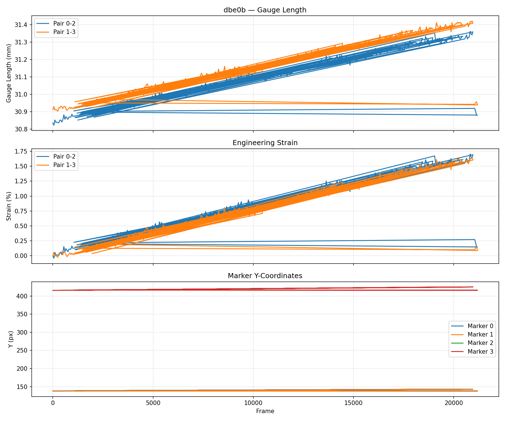
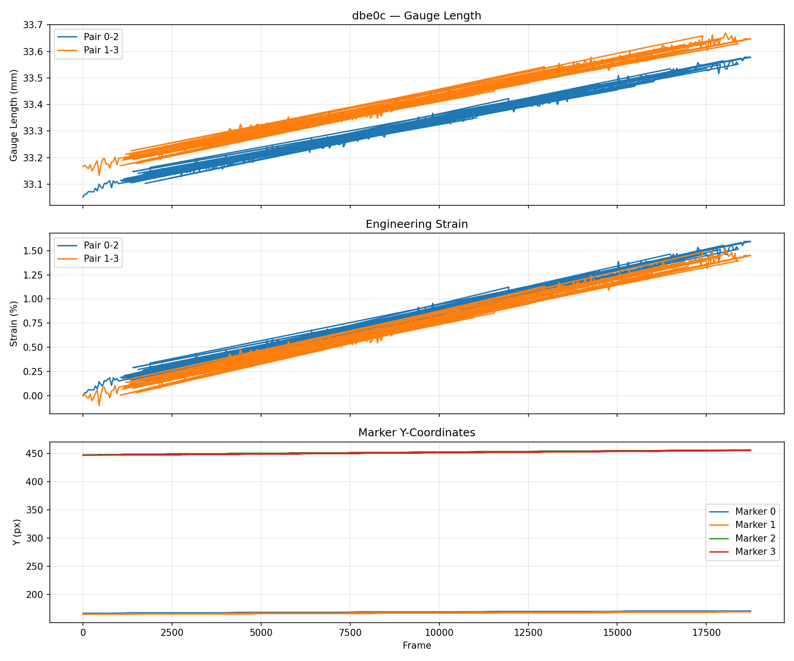

# Optical Gauge Length Tracking via Digital Image Correlation

Tracks black circular markers on tensile test specimens across thousands of video frames to measure gauge length evolution and engineering strain.

Based on:
> Pan, B. et al. (2009). *Two-dimensional digital image correlation for in-plane displacement and strain measurement: a review.* Meas. Sci. Technol. 20, 062001.

## How It Works

1. **Binary image generation** — Adaptive thresholding isolates dark markers from the bright specimen surface.
2. **Morphological cleanup** — Opening/closing removes noise while preserving marker shapes.
3. **Connected component labeling** — `cv2.connectedComponentsWithStats` identifies blobs, filtered by area and circularity.
4. **Centroid tracking** — Area-weighted centroids are computed per marker. Frame-to-frame matching uses nearest-neighbor on centroid distance.
5. **Gauge length** — Euclidean distance between marker pair centroids, converted to mm via calibration factor from `config1.dat`.
6. **Engineering strain** — `e = (d - d0) / d0` where `d0` is the initial gauge length.

## Results

### Dataset: dbe0b (21,199 frames)

| Marker Pair | Initial Gauge Length | Max Strain | Final Strain |
|-------------|---------------------|------------|--------------|
| 0 – 2       | 30.84 mm            | 1.71%      | 0.90%        |
| 1 – 3       | 30.91 mm            | 1.65%      | 0.76%        |



### Dataset: dbe0c (18,835 frames)

| Marker Pair | Initial Gauge Length | Max Strain | Final Strain |
|-------------|---------------------|------------|--------------|
| 0 – 2       | 33.05 mm            | 1.59%      | 0.83%        |
| 1 – 3       | 33.17 mm            | 1.52%      | 0.86%        |



Both specimens show linear elastic loading reaching ~1.6–1.7% peak strain, with the top marker pair separating from the bottom pair as the specimen elongates under tension.

## Dependencies

```
pip install numpy opencv-python matplotlib
```

## Project Structure

```
├── tracker.py       # Marker detection, matching, gauge/strain computation
├── main.py          # Entry point — runs tracking and plots results
├── results/         # Output plots
└── Images/          # Raw image sequences (not tracked in git)
    ├── dbe0b/       # Dataset 1: ~21,000 frames + config1.dat
    └── dbe0c/       # Dataset 2: ~18,800 frames + config1.dat
```

## Usage

```bash
# Run on all datasets (every 10th frame)
python3 main.py

# Single dataset
python3 main.py --dataset dbe0b

# Every frame (slow but precise)
python3 main.py --step 1

# Quick test (first 200 frames)
python3 main.py --max-frames 200
```

## Calibration

Each dataset includes a `config1.dat` file with comma-separated calibration values. The tracker reads the mm/pixel factor automatically to report gauge lengths in physical units.
